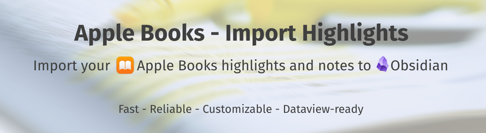
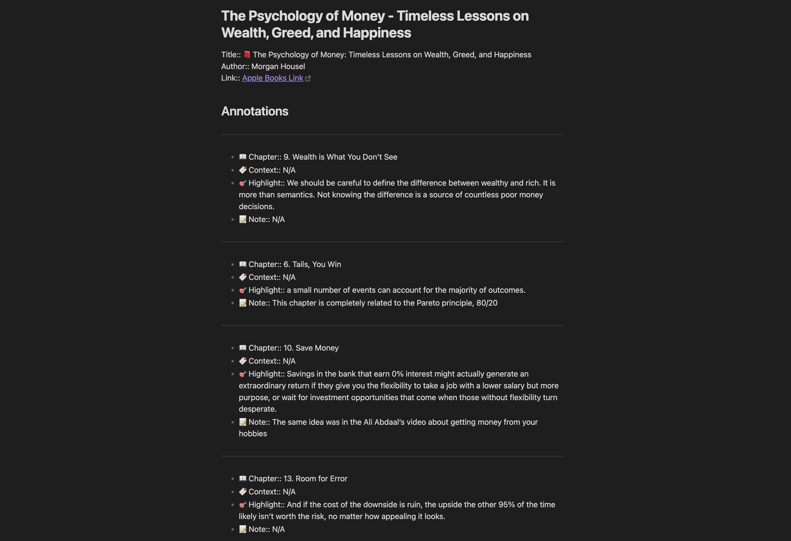

# Obsidian Apple Books highlights import plugin

Import all your Apple Books highlights to Obsidian.




[](https://coveralls.io/github/bandantonio/obsidian-apple-books-highlights-plugin?branch=master)
[](https://forum.obsidian.md/t/new-plugin-apple-books-import-highlights/76856/21)


## Overview

This plugin aims to be a **fast**, **customizable**, **reliable**, and **up-to-date** solution to import your Apple Books highlights to Obsidian:

- **Fast**: It takes less than 1 second to import ~1000 highlights.
- **Customizable**: Use Handlebars and Markdown to customize the output of your highlights the way you want. Check the [`Template variables`](#template-variables) section below for more information.

- **Reliable**:
  - Import actual highlights with only the metadata you need. No visual noise with the deleted but still exported highlights, or, on the contrary, highlights and notes that make no sense without the context.
  - Back up your highlights before each import to avoid accidental data loss (optional, but recommended).
- **Dataview-ready**: The default template creates highlights in a format that is compatible with [Dataview](https://blacksmithgu.github.io/obsidian-dataview/), so you can use your highlights in Dataview queries to unleash possible use cases even further (for example, to create a list of books you've read).
- **Up-to-date**: The plugin is updated regularly to support the latest versions of Obsidian, and Apple Books, as well as react to the users' feedback.

## Preview of imported highlights



## How to install

1. Open **Settings**.
1. Select **Turn on community plugins**
1. Select **Browse** to list all available community plugins.
1. Search for **Apple Books - Import Highlights**.
1. Select **Install**.
1. Select **Enable** right after installation

Check Obsidian Help for more information about [Community plugins](https://help.obsidian.md/Extending+Obsidian/Community+plugins)

## How to use

- **Command palette**:
  - `Cmd+P > Apple Books - Import Highlights: Import all`
  - `Cmd+P > Apple Books - Import Highlights: From a specific book...`
- **Ribbon**: Select the plugin icon in the Ribbon (left sidebar)

## Customization

The plugin uses Handlebars and Markdown to customize the output of your highlights the way you want.

### Template variables

- `{{{bookTitle}}}` - The title of the book.
- `{{bookId}}` - A unique identifier of the book. It is used to create a link to the book in Apple Books: `[Apple Books Link](ibooks://assetid/{{bookId}})`.
- `{{{bookAuthor}}}` - The author of the book.
- `{{{bookGenre}}}` - The genre of the book.
- `{{bookLanguage}}` - The language of the book.
- `{{bookLastOpenedDate}}` - The date when you last opened the book. See the [Date formatting](#date-formatting) section for more information.
- `{{bookCoverUrl}}` - The URL of the book cover.
- `{{annotations}}` - An array of all the annotations in the book. You can use `{{annotations.length}}` to get the total number of annotations you made in the book. Each annotation has the following properties:
  - `{{{chapter}}}` - The chapter of the highlight in the book. It may not be available for all highlights due to the initial formatting of the book.
  - `{{{contextualText}}}` - The text surrounding the highlight to give you more context. For example:
    - If you highlight a part of a sentence, the - `contextualText` will contain the whole sentence.
    - If you highlight parts of two adjacent sentences, the `contextualText` will contain both sentences.
  - `{{{highlight}}}` - The highlighted text.
  - `{{{note}}}` - A note you added for the highlight.
  - `{{highlightStyle}}` - The style of the highlight. It can be one of the following values:
    - `0` (underline)
    - `1` (green)
    - `2` (blue)
    - `3` (yellow)
    - `4` (pink)
    - `5` (violet)
  - `{{highlightCreationDate}}` - The date when you created the highlight. See the [Date formatting](#date-formatting) section for more information.
  - `{{highlightModificationDate}}` - The date when you last modified the highlight. See the [Date formatting](#date-formatting) section for more information.


> [!NOTE]
> When customizing the template, make sure to wrap variables with triple curly braces (`{{{variable}}}`) to avoid escaping the HTML characters in Markdown files (default behavior).
>
> If you want escaped output, use double curly braces: `{{variable}}`.

### Date formatting

The plugin uses the `dateFormat` helper that takes a unix timestamp and the [datajs-compatible string of tokens](https://day.js.org/docs/en/display/format#list-of-all-available-formats) to format dates in the template. For example:

```hbs
// Template
{{dateFormat dateVariable "date format"}}

// Example
{{dateFormat bookLastOpenedDate "YYYY-MM-DD hh:mm:ss A Z"}}
// Result
2024-03-04 05:50:28 PM +01:00

// Example
{{dateFormat bookLastOpenedDate "ddd, MMM DD YYYY, HH:mm:ss Z"}}
Mon, Mar 04 2024, 17:50:28 +02:00
```

### Templates

#### Template with colored highlights


```hbs
Title:: 📕 {{{bookTitle}}}
Author:: {{{bookAuthor}}}
Genre:: {{#if bookGenre}}{{{bookGenre}}}{{else}}N/A{{/if}}
Language:: {{#if bookLanguage}}{{bookLanguage}}{{else}}N/A{{/if}}
Last Read:: {{dateFormat bookLastOpenedDate "YYYY-MM-DD hh:mm:ss A Z"}}
Link:: [Apple Books Link](ibooks://assetid/{{bookId}})

{{#if bookCoverUrl}}{{/if}}

## Annotations

Number of annotations:: {{annotations.length}}

{{#each annotations}}
----

- 📖 Chapter:: {{#if chapter}}{{{chapter}}}{{else}}N/A{{/if}}
- 🔖 Context:: {{#if contextualText}}{{{contextualText}}}{{else}}N/A{{/if}}
{{#if (eq highlightStyle "0")}}- 🎯 Highlight:: <u>{{{highlight}}}</u>{{/if}}
{{#if (eq highlightStyle "1")}}- 🎯 Highlight:: <mark style="background:rgb(175,213,151); color:#000; padding:2px;">{{{highlight}}}</mark>{{/if}}
{{#if (eq highlightStyle "2")}}- 🎯 Highlight:: <mark style="background:rgb(181,205,238); color:#000; padding:2px;">{{{highlight}}}</mark>{{/if}}
{{#if (eq highlightStyle "3")}}- 🎯 Highlight:: <mark style="background:rgb(249,213,108); color:#000; padding:2px;">{{{highlight}}}</mark>{{/if}}
{{#if (eq highlightStyle "4")}}- 🎯 Highlight:: <mark style="background:rgb(242,178,188); color:#000; padding:2px;">{{{highlight}}}</mark>{{/if}}
{{#if (eq highlightStyle "5")}}- 🎯 Highlight:: <mark style="background:rgb(214,192,238); color:#000; padding:2px;">{{{highlight}}}</mark>{{/if}}
- 📝 Note:: {{#if note}}{{{note}}}{{else}}N/A{{/if}}
- <small>📅 Highlight taken on:: {{dateFormat highlightCreationDate "YYYY-MM-DD hh:mm:ss A Z"}}</small>
- <small>📅 Highlight modified on:: {{dateFormat highlightModificationDate "YYYY-MM-DD hh:mm:ss A Z"}}</small>

{{/each}}
```


## Contributing

Your feedback and ideas are more than welcome and highly appreciated! Join the discussion in the [Obsidian Forum](https://forum.obsidian.md/t/new-plugin-apple-books-import-highlights/76856).

If you have any question, feedback, or issue, feel free to open an issue.
