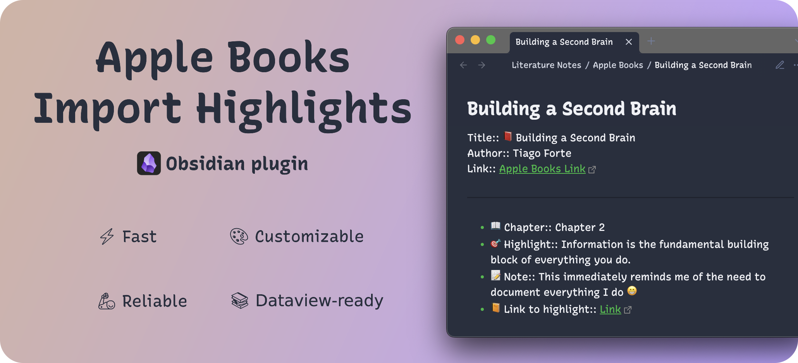

# Obsidian Apple Books highlights import plugin

## Overview

This plugin aims to be a **fast**, **customizable**, **reliable**, and **up-to-date** solution to import your Apple Books highlights to Obsidian:

- ⚡️ **Fast**: It takes less than 1 second to import ~1000 highlights.
- 🎨 **Customizable**: Use Handlebars and Markdown to customize the output of your highlights the way you want. Check the [`Template variables`](https://mister-gold.pro/obsidian-apple-books-highlights-plugin/customization/templates-and-variables.html#template-variables) section in documentation for more information.

- 🦾 **Reliable**:
  - Import actual highlights with only the metadata you need. No visual noise with the deleted but still exported highlights, or, on the contrary, highlights and notes that make no sense without the context.
  - Back up your highlights before each import to avoid accidental data loss (optional, but recommended).
- 📚 **Dataview-ready**: The default template creates highlights in a format that is compatible with [Dataview](https://blacksmithgu.github.io/obsidian-dataview/), so you can use your highlights in Dataview queries to unleash possible use cases even further (for example, to create a list of books you've read).
- 🔄 **Up-to-date**: The plugin is updated regularly to support the latest versions of Obsidian, and Apple Books, as well as react to the users' feedback.

## What users say

- 💬 *Nice work. This is really quick*. - **cmyplay**
- 💬 *I just wanted to say that I love your plugin. It’s exactly what I need with no frills*. - **civilserf**
- 💬 *I am very grateful for the plugin you developed, which has made organizing my reading notes much more convenient*. - **JeffreyGH10**
- 💬 *Love this! great work!* - **dschense**
- 💬 *Thanks for sharing this nice plugin*. - **modatwork**
- 💬 *Your plugin is super fast and useful!* - **weslau**

## Try it out

## Documentation

- [Get Started][get-started]
- [Settings][settings]
- [Templates and variables][templates-and-variables]

[get-started]: https://mister-gold.pro/obsidian-apple-books-highlights-plugin/guide/get-started.html
[settings]: https://mister-gold.pro/obsidian-apple-books-highlights-plugin/guide/settings.html
[templates-and-variables]: https://mister-gold.pro/obsidian-apple-books-highlights-plugin/customization/templates-and-variables.html

## Contributing

Ready to contribute? Check the [Contributing guidelines](CONTRIBUTING.md) to get started.

Your feedback and ideas are more than welcome and highly appreciated! Join the discussion in:
- [Obsidian Forum](https://forum.obsidian.md/t/new-plugin-apple-books-import-highlights/76856)
- [GitHub Discussions](https://github.com/bandantonio/obsidian-apple-books-highlights-plugin/discussions)
