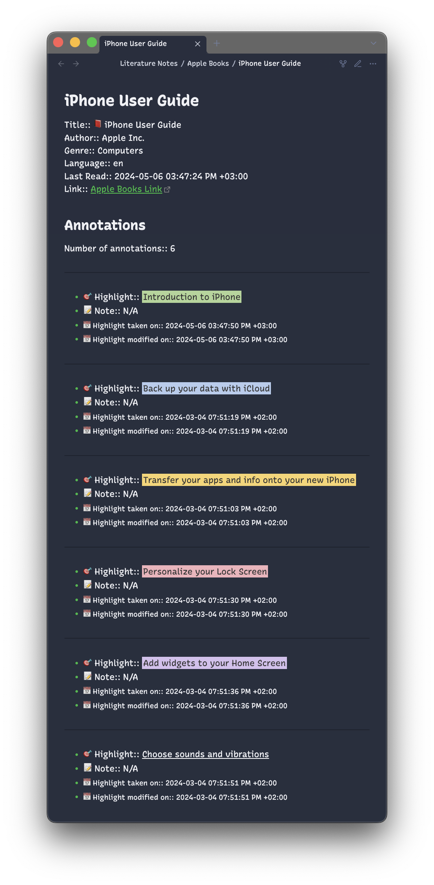

# Templates and variables
<!-- Custom container to prevent Handlebars variables to be treated as Vue interpolations -->
<span v-pre>

The plugin uses Handlebars and Markdown to customize the output of your highlights the way you want.
<!-- <<< ../../src/template.ts -->

## Default template

```hbs
Title:: 📕 {{{bookTitle}}}
Author:: {{{bookAuthor}}}
Link:: [Apple Books Link](ibooks://assetid/{{bookId}})

## Annotations

Number of annotations:: {{annotations.length}}

{{#each annotations}}
----

- 📖 Chapter:: {{#if chapter}}{{{chapter}}}{{else}}N/A{{/if}}
- 🔖 Context:: {{#if contextualText}}{{{contextualText}}}{{else}}N/A{{/if}}
- 🎯 Highlight:: {{{highlight}}}
- 📝 Note:: {{#if note}}{{{note}}}{{else}}N/A{{/if}}
- 📙 Highlight Link:: {{#if highlightLocation}}[Apple Books Highlight Link](ibooks://assetid/{{../bookId}}#{{highlightLocation}}){{else}}N/A{{/if}}

{{/each}}
```

## Custom templates

::: details Colored highlights
```hbs
Title:: 📕 {{{bookTitle}}}
Author:: {{{bookAuthor}}}
Genre:: {{#if bookGenre}}{{{bookGenre}}}{{else}}N/A{{/if}}
Language:: {{#if bookLanguage}}{{bookLanguage}}{{else}}N/A{{/if}}
Last Read:: {{dateFormat bookLastOpenedDate "YYYY-MM-DD hh:mm:ss A Z"}}
Link:: [Apple Books Link](ibooks://assetid/{{bookId}})

{{#if bookCoverUrl}}{{/if}}

## Annotations

Number of annotations:: {{annotations.length}}

{{#each annotations}}
----

{{#if (eq highlightStyle "0")}}- 🎯 Highlight:: <u>{{{highlight}}}</u>
{{else if (eq highlightStyle "1")}}- 🎯 Highlight:: <mark style="background:rgb(175,213,151); color:#000; padding:2px;">{{{highlight}}}</mark>
{{else if (eq highlightStyle "2")}}- 🎯 Highlight:: <mark style="background:rgb(181,205,238); color:#000; padding:2px;">{{{highlight}}}</mark>
{{else if (eq highlightStyle "3")}}- 🎯 Highlight:: <mark style="background:rgb(249,213,108); color:#000; padding:2px;">{{{highlight}}}</mark>
{{else if (eq highlightStyle "4")}}- 🎯 Highlight:: <mark style="background:rgb(242,178,188); color:#000; padding:2px;">{{{highlight}}}</mark>
{{else if (eq highlightStyle "5")}}- 🎯 Highlight:: <mark style="background:rgb(214,192,238); color:#000; padding:2px;">{{{highlight}}}</mark>
{{/if}}
- 📝 Note:: {{#if note}}{{{note}}}{{else}}N/A{{/if}}
- <small>📅 Highlight taken on:: {{dateFormat highlightCreationDate "YYYY-MM-DD hh:mm:ss A Z"}}</small>
- <small>📅 Highlight modified on:: {{dateFormat highlightModificationDate "YYYY-MM-DD hh:mm:ss A Z"}}</small>

{{/each}}
```


:::

> [!TIP]
> If you created a template you love and want to share it with others, you're welcome to do it in the [corresponding topic](https://github.com/bandantonio/obsidian-apple-books-highlights-plugin/discussions/32). Your contribution will also help others to get inspired and create their own templates. Thank you!

## Template variables

- `{{{bookTitle}}}` - The title of the book.
- `{{bookId}}` - A unique identifier of the book. It is used to create a link to the book in Apple Books: `[Apple Books Link](ibooks://assetid/{{bookId}})`.
- `{{{bookAuthor}}}` - The author of the book.
- `{{{bookGenre}}}` - The genre of the book.
- `{{bookLanguage}}` - The language of the book.
- `{{bookLastOpenedDate}}` - The date when you last opened the book. See the [Date formatting](#date-formatting) section for more information.
- `{{bookCoverUrl}}` - The URL of the book cover.
- `{{annotations}}` - An array of all the annotations in the book. You can use `{{annotations.length}}` to get the total number of annotations you made in the book. Each annotation has the following properties:
  - `{{{chapter}}}` - The chapter of the highlight in the book. It may not be available for all highlights due to the initial formatting of the book.
  - `{{{contextualText}}}` - The text surrounding the highlight to give you more context. For example:
    - If you highlight a part of a sentence, the - `contextualText` will contain the whole sentence.
    - If you highlight parts of two adjacent sentences, the `contextualText` will contain both sentences.
  - `{{{highlight}}}` - The highlighted text.
  - `{{{note}}}` - A note you added for the highlight.
  - `{{{highlightLocation}}}` - A unique identifier of the highlighted text. It is used to create a link to the highlighted text in Apple Books. For example: `[Apple Books Highlight Link](ibooks://assetid/{{bookId}}#{{highlightLocation}})`.
  - `{{highlightStyle}}` - The style of the highlight. It can be one of the following values:
    - `0` (underline)
    - `1` (green)
    - `2` (blue)
    - `3` (yellow)
    - `4` (pink)
    - `5` (violet)
  - `{{highlightCreationDate}}` - The date when you created the highlight. See the [Date formatting](#date-formatting) section for more information.
  - `{{highlightModificationDate}}` - The date when you last modified the highlight. See the [Date formatting](#date-formatting) section for more information.

> [!IMPORTANT]
> When customizing the template, make sure to wrap variables with triple curly braces (`{{{variable}}}`) to avoid escaping the HTML characters in Markdown files (default behavior).
>
> If you want escaped output, use double curly braces: `{{variable}}`.

## Date formatting

The plugin uses the `dateFormat` helper that takes a unix timestamp and the [datajs-compatible string of tokens](https://day.js.org/docs/en/display/format#list-of-all-available-formats) to format dates in the template. For example:

```hbs
// Template
{{dateFormat dateVariable "date format"}}

// Example 1
{{dateFormat bookLastOpenedDate "YYYY-MM-DD hh:mm:ss A Z"}}
2024-03-04 05:50:28 PM +01:00

// Example 2
{{dateFormat bookLastOpenedDate "ddd, MMM DD YYYY, HH:mm:ss Z"}}
Mon, Mar 04 2024, 17:50:28 +02:00
```

## Contextual text

There are two helpers to extract the contextual text before and after the highlighted portion: `contextBefore` and `contextAfter`.

For example:

```hbs
🎯 Highlight:: {{contextBefore highlight contextualText}}<mark>{{highlight}}</mark>{{contextAfter highlight contextualText}}
```

Renders:

````markdown
```
🎯 Highlight:: Something before <mark>the thing I highlighted</mark>, and then
something after
```
````

Both of these helpers assume that `contextualText` contains `highlight`. This should be true when used directly with the `contextualText`/`highlight` template variables above, though nothing prevents using these helpers with other variables, where that assumption might not hold.

<!-- End of custom container to prevent Handlebars variables to be treated as Vue interpolations -->
</span>
