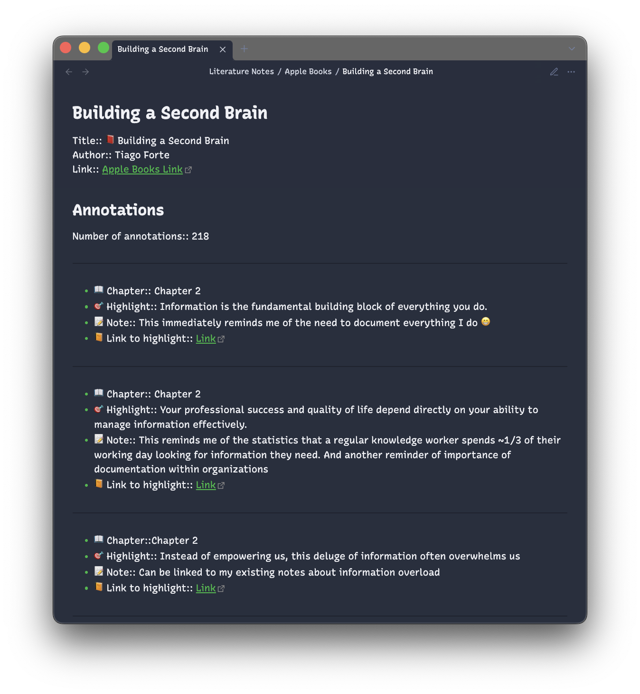
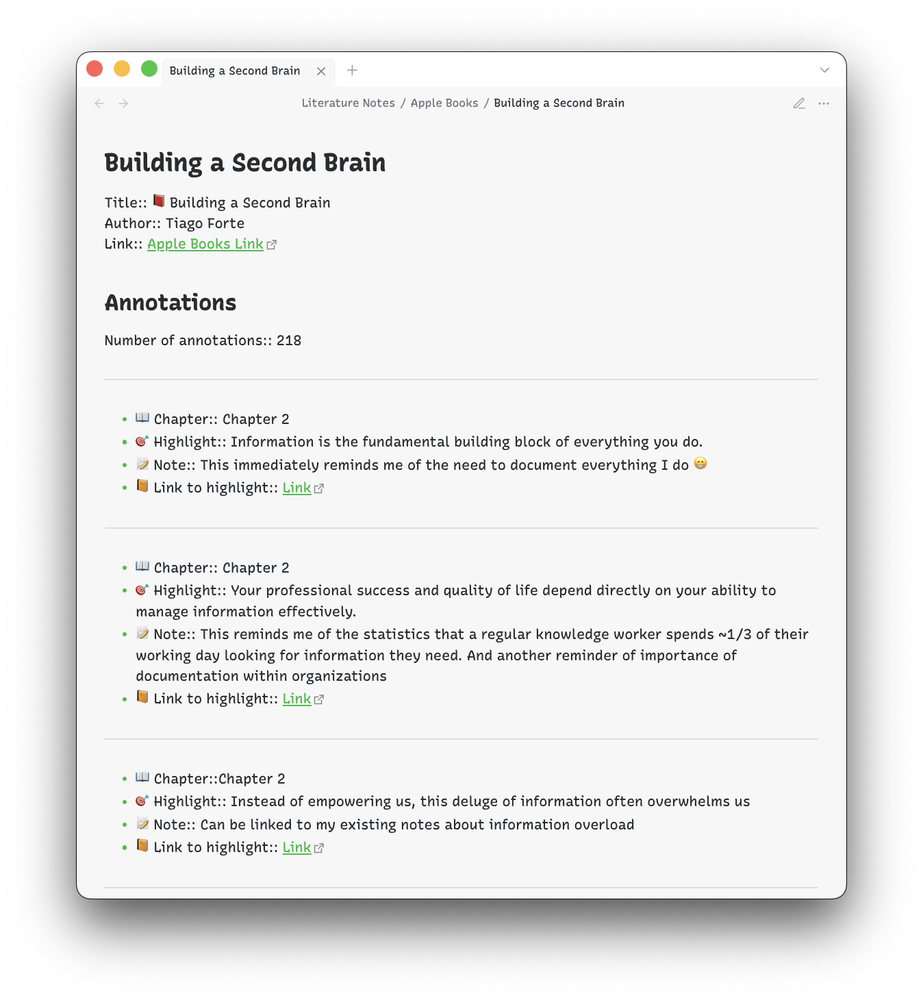

# Get Started

This plugin imports all your Apple Books highlights to Obsidian in one click.

## Installation
### Outside of Obsidian

1. Go to [the plugin's page on the Obsidian site](https://obsidian.md/plugins?id=apple-books-import-highlights) (this link is available in the "About" section of the plugin's repository)
1. Confirm the browser prompt to allow the website to open Obsidian.
1. In the Obsidian app:
	1. Click **Install** on the plugin's page.
	1. Click **Enable** right after installation.

### Inside Obsidian

1. Open **Settings**.
1. Click **Turn on community plugins**
1. Click **Browse** to list all available community plugins.
1. Search for **Apple Books - Import Highlights**.
1. Click **Install**.
1. Click **Enable** right after installation

## Usage

The plugin allows you to import all your highlights or highlights from a specific book.

- If you want to import **all your highlights**, you can either use the Ribbon (left sidebar) or the Command palette:
	- **Ribbon**: Click the plugin icon ()
	- **Command palette**: `Cmd+P` > `Apple Books - Import Highlights: Import all`
- If you want to import **highlights from a specific book**, you can use the Command palette:
	- `Cmd+P` > `Apple Books - Import Highlights: From a specific book...`

## Screenshots

