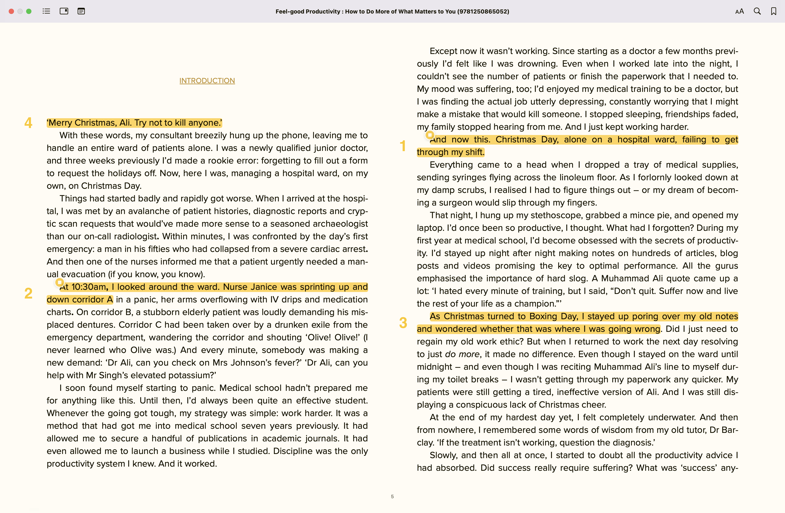

# Settings

## Highlight folder

- Default value: `ibooks-highlights`

A folder (within the root of your vault) where you want to save imported highlights. You can use digits, dashes, underscores, or spaces in the folder name. To specify a subfolder of any depth, use `/` as a separator. If the specified path does not exist (fully or partially), it will be created.

For example, below are some valid folder names:

- `notes/highlights`
- `imported_notes/apple_books/highlights`
- `3 - Resources/My Books/Apple Books/Unprocessed`

## Import highlights on start

- Default value: Turned off

Import all highlights from all your books when Obsidian starts. Respects the [Backup highlights](#backup-highlights) setting.

## Backup highlights

- Default value: Turned off
- Backup template:
	- for the highlight folder: `<highlights-folder>-bk-<timestamp>`. For example, `ibooks-highlights-bk-1704060001`.
	- for a specific book: `<highlights-file>-bk-<timestamp>`. For example, `Building a Second Brain-bk-1704060001`.

Backup highlights before import.
- When importing all highlights, the [highlight folder](#highlight-folder) contents (see the note below) will be backed up.
- When importing highlights from a specific book, the specific highlights file will be backed up, if it exists.

The backup name is pre-configured based on the template above and cannot be changed.

::: details Examples

**Import all highlights**

Initial state
```plaintext
.
└── ibooks-highlights
    ├── Atomic Habits - Tiny Changes, Remarkable Results
    └── Building a Second Brain
```
After import
```plaintext
.
├── ibooks-highlights
│   └── <newly imported highlights>
└── ibooks-highlights-bk-1723233525489
    ├── Atomic Habits - Tiny Changes, Remarkable Results
    └── Building a Second Brain
```
**Import highlights from a specific book**

Initial state
```plaintext
.
└── ibooks-highlights
    ├── Atomic Habits - Tiny Changes, Remarkable Results
    └── Building a Second Brain
```
After import
```plaintext
.
└── ibooks-highlights
    ├── Atomic Habits - Tiny Changes, Remarkable Results
	├── Atomic Habits - Tiny Changes, Remarkable Results-bk-1723234215251
    └── Building a Second Brain
```

:::

> [!NOTE]
> The plugin will back up only the files that are direct children of the [highlight folder](#highlight-folder). If you (for some reason) have a nested folder structure inside the [highlight folder](#highlight-folder), these folders will not be backed up and will be overwritten on import.

> [!TIP]
> To prevent accidental data loss when the setting is turned off, the plugin will display a confirmation dialog before overwriting the existing highlights.

## Highlights sorting criterion

- Default value: By creation date (from oldest to newest)

Sort highlight by a specific criterion.

The available options are:

- By creation date (from oldest to newest)
- By creation date (from newest to oldest)
- By last modification date* (from oldest to newest)
- By last modification date* (from newest to oldest)
- By location in a book

::: tip What a modification is?
Modification includes the following cases:

- Updating highlight text
- Adding or updating a note
- Changing the highlight color or style
:::

::: details Examples

Let's consider an example book with the following highlights (callouts to the left indicate the order in which the highlights were created):



- **By creation date (from oldest to newest)**: The highlights that were created first will be at the top.

	::: details Example
	```md
	## Annotations
	----
	- 🎯 Highlight:: And now this. Christmas Day, alone on a hospital ward, failing to get through my shift.
	----
	- 🎯 Highlight:: At 10:30am, I looked around the ward. Nurse Janice was sprinting up and down corridor A
	----
	- 🎯 Highlight:: As Christmas turned to Boxing Day, I stayed up poring over my old notes and wondered whether that was where I was going wrong
	----
	- 🎯 Highlight:: ‘Merry Christmas, Ali. Try not to kill anyone.’
	```
	:::

- **By creation date (from newest to oldest)**: The highlights that were created last will be at the top.

	::: details Example
	```md
	## Annotations
	----
	- 🎯 Highlight:: ‘Merry Christmas, Ali. Try not to kill anyone.’
	----
	- 🎯 Highlight:: As Christmas turned to Boxing Day, I stayed up poring over my old notes and wondered whether that was where I was going wrong
	----
	- 🎯 Highlight:: At 10:30am, I looked around the ward. Nurse Janice was sprinting up and down corridor A
	----
	- 🎯 Highlight:: And now this. Christmas Day, alone on a hospital ward, failing to get through my shift.
	```
	:::

- **By last modification date (from oldest to newest)**: The highlights that were modified first will be at the top.

	::: details Example
	```md
	## Annotations
	----
	- 🎯 Highlight:: As Christmas turned to Boxing Day, I stayed up poring over my old notes and wondered whether that was where I was going wrong
	- 📝 Note:: N/A
	----
	- 🎯 Highlight:: ‘Merry Christmas, Ali. Try not to kill anyone.’
	- 📝 Note:: N/A
	----
	- 🎯 Highlight:: At 10:30am, I looked around the ward. Nurse Janice was sprinting up and down corridor A
	- 📝 Note:: Test modification date (modified first)
	----
	- 🎯 Highlight:: And now this. Christmas Day, alone on a hospital ward, failing to get through my shift.
	- 📝 Note:: Test modification date (modified second)
	```
	:::

- **By last modification date (from newest to oldest)**: The highlights that were modified last will be at the top.

	::: details Example
	```md
	## Annotations
	----
	- 🎯 Highlight:: And now this. Christmas Day, alone on a hospital ward, failing to get through my shift.
	- 📝 Note:: Test modification date (modified second)
	----
	- 🎯 Highlight:: At 10:30am, I looked around the ward. Nurse Janice was sprinting up and down corridor A
	- 📝 Note:: Test modification date (modified first)
	----
	- 🎯 Highlight:: ‘Merry Christmas, Ali. Try not to kill anyone.’
	- 📝 Note:: N/A
	----
	- 🎯 Highlight:: As Christmas turned to Boxing Day, I stayed up poring over my old notes and wondered whether that was where I was going wrong
	- 📝 Note:: N/A
	```
	:::

- **By location in a book**: Highlights are sorted by their location in a book.

	::: details Example
	```md
	## Annotations
	----
	- 🎯 Highlight:: ‘Merry Christmas, Ali. Try not to kill anyone.’
	- 📝 Note:: N/A
	----
	- 🎯 Highlight:: At 10:30am, I looked around the ward. Nurse Janice was sprinting up and down corridor A
	- 📝 Note:: Test modification date (modified first)
	----
	- 🎯 Highlight:: And now this. Christmas Day, alone on a hospital ward, failing to get through my shift.
	- 📝 Note:: Test modification date (modified second)
	----
	- 🎯 Highlight:: As Christmas turned to Boxing Day, I stayed up poring over my old notes and wondered whether that was where I was going wrong
	- 📝 Note:: N/A
	```
	:::
:::

## Template

- Template for highlight files.

Check the [Templates and variables](/customization/templates-and-variables) page for more information.

## Template for naming highlight files

<!-- Custom container to prevent Handlebars variables to be treated as Vue interpolations -->
<span v-pre>

- Default value: `{{{bookTitle}}}`

<!-- End of custom container to prevent Handlebars variables to be treated as Vue interpolations -->
</span>

Template to generate the name of highlight files. Check the [Template variables for filenames](/customization/templates-and-variables#template-variables-for-filenames) section for more information.

## Reset template

- Reset template to default

A quick way to reset the template to the [default one](/customization/templates-and-variables#default-template). May be useful if you've made a mistake or any unwanted changes to the template and want to start over.
